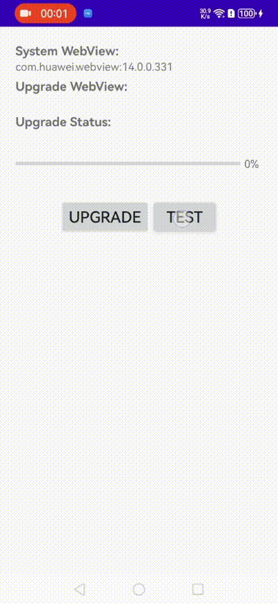

# WebViewUpgrade
简体中文 | [English](./README.md)

还在经受WebView差异化带来的兼容问题，还在为腾讯X5内核收费所困扰，这个库也许就能轻松解决这些问题，它实现了Android免安装升级WebView内核的功能。如果你觉得有所收获，给这个库点个Star吧，你的鼓励是我前进最大的动力，这年头写代码不就这点追求嘛😊。

### 作用域

这个库**接入在业务 App 内**，只改变**本应用** WebView，**不会**替换系统全局 WebView，也**不会**影响其他已安装应用。

### WebView 安装包

各厂商、架构、版本的 WebView / Chrome安装包见 **[WebViewPackage](https://github.com/JonaNorman/WebViewPackage)** 仓库

Android5.0以后WebView升级需要去Google Play安装APK，就算安装了以后也不一定能行，像华为、Amazon等特殊机型WebView的Chromium版本一般比较低，只能用它自己的WebView无法用Google的WebView。

我就遇到了华为机上因为WebView内核的Chromium版本低于107无法播放H265视频的情况，为了解决上述问题可以用JS实现H265播放，但是会比较卡，这个时候我就想能不能让WebView用应用内的APK作为内核，下图是升级WebView内核的前后效果对比



升级前在华为机上的系统WebView内核包名是`com.huawei.webview`，版本是14.0.0.331，UserAgent中的Chromium实际版本是99.0.4844.88,如下图所示小于107不支持H265播放


Demo中可查看系统 WebView、已装 Chrome、当前宿主使用的内核，以及升级进度与操作入口：


「选择 / 更换内核」对话框中可从内置、已安装、已下载与在线等来源挑选版本：


升级成功的WebView内涵的包名变成了`com.google.android.webview`，UserAgent中的Chromium实际版本也变成了122.0.6261.64


# 使用

```gradle
implementation 'io.github.jonanorman.android.webviewup:core:0.1.0'
```

支持四种WebView来源 **UpgradeSource**：`UpgradeDownloadSource`（按 URL 下载）、`UpgradeFileSource`（本地 apk 文件）、`UpgradeAssetSource`（assets 里的 apk）、`UpgradePackageSource`（本机已安装的包名，如 Chrome）。先 `new` 出其中一个赋给 `source`，再：

```java
WebViewUpgrade.upgrade(source);
```

需要进度或成败回调时，可在 `upgrade` 前 `WebViewUpgrade.addUpgradeCallback(...)`。

# 兼容性

Android的设备五花八门，已测试以下功能和机型，欢迎大家提issue和Merge Request加入到这个项目中来，可以搜索微信号JonaNorman加我个人微信拉你进群(请备注WebView升级)


## 支持范围

- **多进程 WebView**：已支持
- **Android 15 / 16**：已支持

## 升级时机（必读）

进程内**第一次创建 WebView** 时会绑定当时的 WebView 实现；**更换为另一种内核**也不能在同进程内热替换，须**重启 App**（彻底退出并冷启动）后新内核才会生效。若要**首次**升级后立刻用上、**无需重启**，请在**任意 WebView 尚未创建之前**完成升级（例如用户进入带 WebView 的页面前先调用升级逻辑）。若**已经点开过 WebView** 再升级或换核，一般需要**彻底冷启动 App** 后新内核才会生效。

## 使用 Chrome 作为内核时的限制

仅支持作为**单个完整 APK** 提供的 Chrome（与 [WebViewPackage](https://github.com/JonaNorman/WebViewPackage) 中归档的全量包一致）。**Google Play 应用分包（base + 多个 split APK）安装的 Chrome 不在支持范围内**，无法按本库流程作为可加载的一体化内核包使用。

## 机型
| 厂商         | 系统版本 |
| :----------- | -------- |
| 华为Mate30   | 12       |
| 小米10       | 11       |
| VIVO NEX A   | 10       |
| OPPO FIND X5 | 14       |

原理介绍: [地址](https://juejin.cn/post/7340900764364472332#heading-4)


# ⭐ star历史


# 特别感谢

| Stargazers                                                                                                 | Forkers                                                                                                                 |
|---------------------------------------------------------------------------------------------------------|-------------------------------------------------------------------------------------------------------------------------|
| [](https://github.com/JonaNorman/WebViewUpgrade/stargazers)                                          | [](https://github.com/JonaNorman/WebViewUpgrade/network/members)                            |
