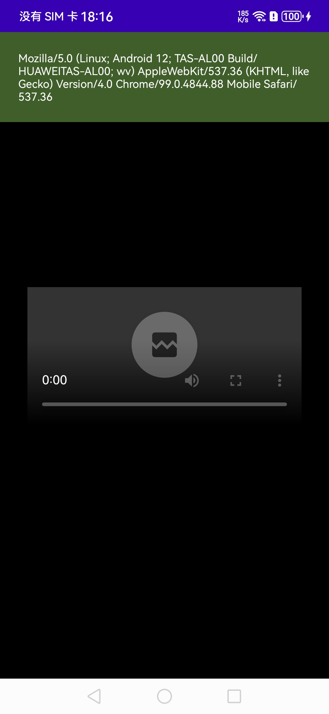
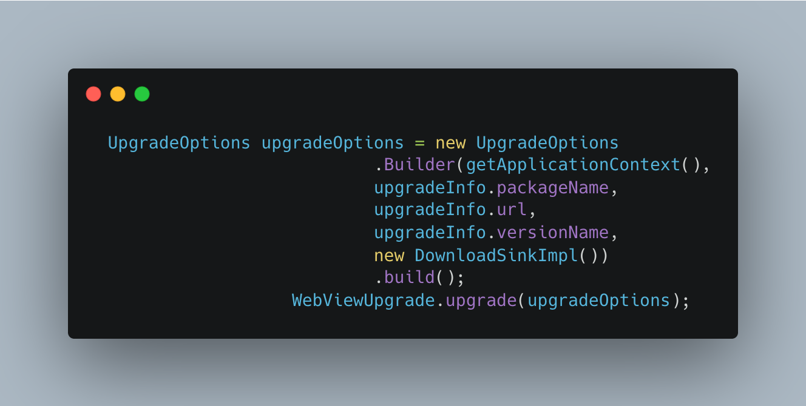
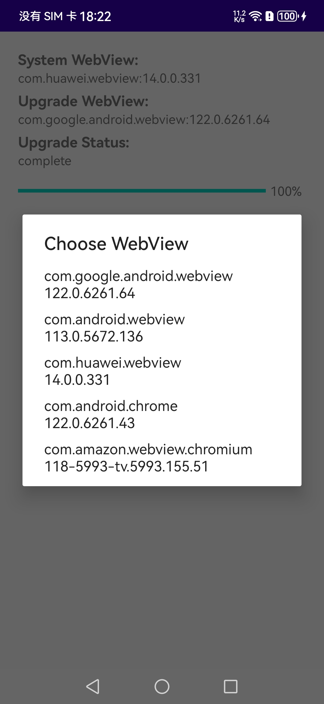

# WebViewUpgrade

English | [简体中文](./README-ZH.md)

This library implements the functionality of upgrading the WebView kernel on Android without installation.

After Android 5.0, upgrading WebView requires installing an APK. In situations where Google Play is not available, it's impossible to find the update package. Even if found, special device models like Huawei and Amazon typically have lower versions of WebView's Chromium, which cannot be replaced with Google's WebView.

I encountered a situation where WebView couldn't play H265 videos on a Huawei device due to the Chromium version being lower than 107. To resolve this issue, the conventional approach is usually to implement H265 playback using JavaScript, but this can be sluggish. At this point, I wondered if WebView could use the APK within the application as its kernel. The image below shows the before and after effects of upgrading the WebView kernel:

It's apparent that on Huawei devices, the WebView kernel package name is `com.huawei.webview` with a version of 14.0.0.331. The Chromium version in the UserAgent is actually 99.0.4844.88, as shown in the image below. It does not support H265 playback as it is less than 107:

After successfully upgrading the kernel using the code provided below, WebView can play H265 videos:

The WebView kernel selection page looks like the image below:

After successful upgrade, the WebView package name changes to `com.google.android.webview`, and the Chromium version in the UserAgent becomes 122.0.6261.64:

## Compatibility

Android devices vary greatly. The following features and device models have been tested. Contributions through issue submission and Merge Requests to this project are welcomed.

### Feature Characteristics

| WebView Package Name         | System Version      |
|:-----------------------------| ------------------- |
| com.google.android.webview  | 122.0.6261.64       |
| com.android.webview         | 113.0.5672.136      |
| com.huawei.webview          | 14.0.0.331          |
| com.android.chrome          | 122.0.6261.43       |
| com.amazon.webview.chromium | 118-5993-tv.5993.155.51 |

### Device Models

| Manufacturer  | System Version |
| :------------ | -------------- |
| Huawei Mate30 | 12             |
| Xiaomi 10     | 11             |
| VIVO NEX A    | 10             |
| OPPO FIND X5  | 14             |

**Upcoming Features**

- [ ] Multi-process
- [ ] Dynamic Switch

# ⭐ Star History

# Special Thanks

| Stargazers                                                                                                 | Forkers                                                                                                                 |
|---------------------------------------------------------------------------------------------------------|-------------------------------------------------------------------------------------------------------------------------|
|                                           |                             |