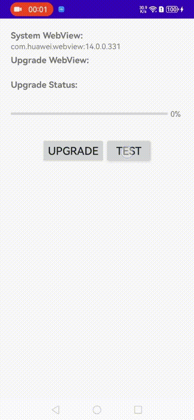

# WebViewUpgrade

English | [简体中文](./README-ZH.md)

This library implements the functionality of upgrading the WebView kernel on Android without installation.

After Android 5.0, upgrading WebView requires installing an APK from Google Play, and even after installation, it may not work as expected. For special device models like Huawei and Amazon, the Chromium version of WebView is generally lower, making it impossible to use Google's WebView instead of the device's own WebView.

I encountered a situation on Huawei devices where H265 video playback was not possible due to the Chromium version of the WebView kernel being lower than 107. To address this issue, H265 playback can be implemented using JavaScript, but this approach may lead to performance issues. At this point, I wondered if WebView could utilize the APK within the application as its kernel. The image below shows the before and after effects of upgrading the WebView kernel:



Before the upgrade, the WebView kernel package name on Huawei devices was `com.huawei.webview`, with a version of 14.0.0.331. The Chromium version in the UserAgent was actually 99.0.4844.88, as shown in the image below, which does not support H265 playback as it is less than 107:


After successfully upgrading the kernel using the code provided below, H265 video playback becomes possible:


The WebView kernel selection page looks like the image below:


After a successful upgrade, the package name of the WebView kernel changes to `com.google.android.webview`, and the Chromium version in the UserAgent also changes to 122.0.6261.64:


# implementation
```gradle
implementation 'io.github.jonanorman.android.webviewup:core:0.1.0'// 不需要下载APK时使用
implementation 'io.github.jonanorman.android.webviewup:download-source:0.1.0'// 需要下载APK使用
```

```java
            UpgradeDownloadSource  upgradeSource = new UpgradeDownloadSource(
                    context,
                    url,
                    file
            );
            WebViewUpgrade.upgrade(upgradeSource);
```

## Compatibility

Android devices vary greatly. The following features and device models have been tested. Contributions through issue submissions and Merge Requests to this project are welcomed.

### Feature Characteristics

| WebView Package Name         | System Version      |
|:-----------------------------| ------------------- |
|com.google.android.webview     | 122.0.6261.64  |
| com.android.webview       | 113.0.5672.136      |
| com.huawei.webview   | 14.0.0.331     |
| com.android.chrome | 122.0.6261.43     |
| com.amazon.webview.chromium | 118-5993-tv.5993.155.51   |

### Device Models

| Manufacturer  | System Version |
| :------------ | -------------- |
| Huawei Mate30 | 12             |
| Xiaomi 10     | 11             |
| VIVO NEX A    | 10             |
| OPPO FIND X5  | 14             |

**Upcoming Features**

- [ ] Multi-process
- [ ] Dynamic Switching

# ⭐ Star History


# Special Thanks

| Stargazers                                                                                                 | Forkers                                                                                                                 |
|---------------------------------------------------------------------------------------------------------|-------------------------------------------------------------------------------------------------------------------------|
| [](https://github.com/JonaNorman/WebViewUpgrade/stargazers)                                          | [](https://github.com/JonaNorman/WebViewUpgrade/network/members)                            |
